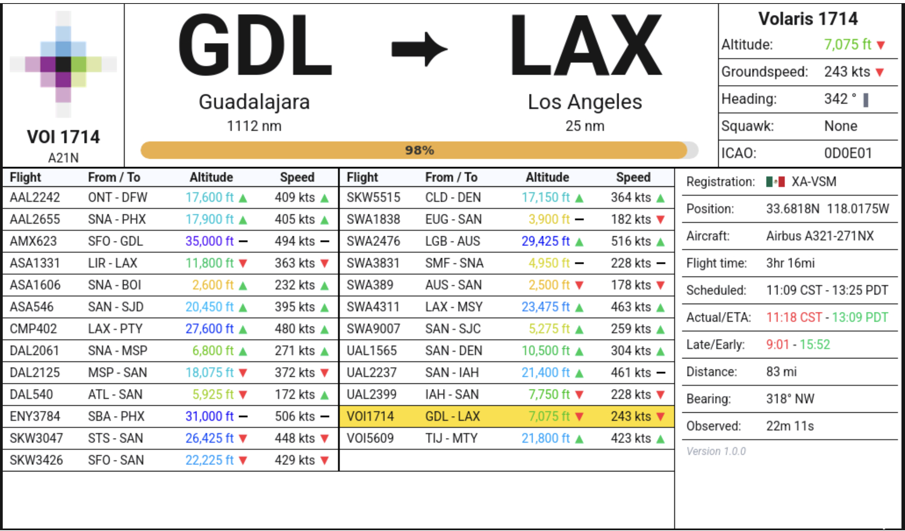
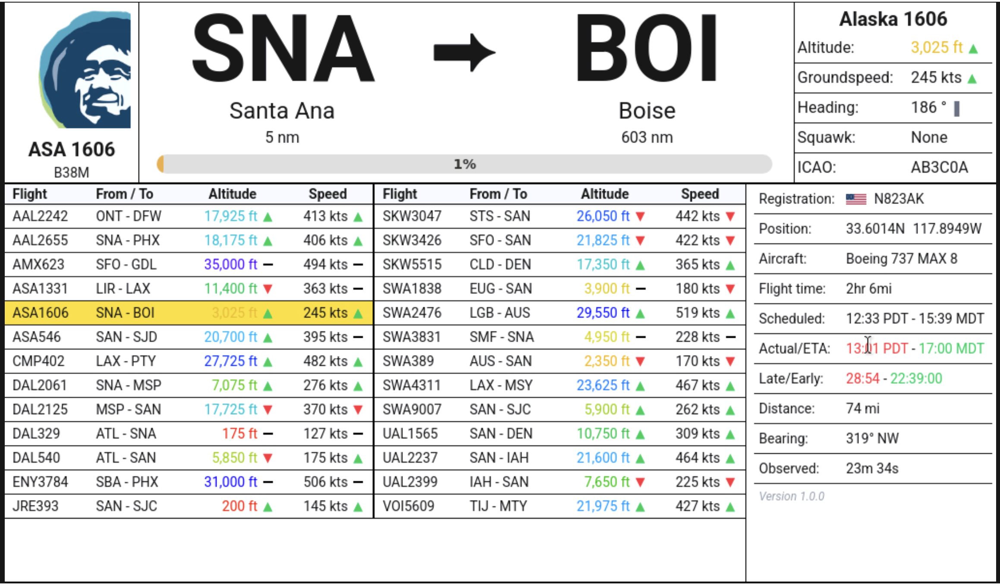

# Flight Tracker

Load this flight tracker application on a Raspberry Pi to track aircraft within
a radius around any location.

## Application architecture

The application uses a Python back end to retrieve and save real-time flight tracking
data and hosts a web front end running on Chromium to display the information.

## Hardware requirements

I started with a Raspberry Pi 3B+, 32GB SD card running Raspbian Trixie OS (current as of Jun 2026).
Internet connectivity is required so if you're using a 3B+ you'll need a separate WiFi dongle.
The display is a Wimaxit M1012 10.1" touchscreen, which is a good balance between
a compact size and displaying comprehensive information.

I'm pretty sure that this will work with newer Raspberry Pi models
like the 4, and 5, and possibly with the Pi Zero, though I haven't
tested any other models. Let me know if you have success with other
models and I'll update this README.

## Instructions

### OS imaging and setup

1. Use the Raspberry Pi Imager to flash your SD card with Raspbian Trixie OS. You will need to download the Desktop
   version.
    * It will be helpful to set up the Raspberry Pi Connect functionality to make it easier to set up the Pi remotely
      from your computer rather with screen-sharing and a remote terminal than having to plug in a keyboard and mouse to
      the Pi
2. Start the Pi and connect to it via Raspberry Pi Connect.
3. Once connected to screen sharing you'll need to turn off the virtual keyboard
    * Click the top left menu button and select Settings
    * Scroll down to the bottom and click on the "Display" section
    * Turn off the "Show Virtual Keyboard" option

### Raspberry Pi autostart configuration

Now we need to configure the Pi to start the application in kiosk mode, hiding the menu bar, task bar, and opening a
frameless Chromium browser window. Follow these instructions

    * From the terminal open a nano editor `sudo nano ~/.config/labwc/autostart`. Copy / paste this code. If you defined
      a different user than the default `pi` change the folder appropriately.

```bash
#!/bin/bash
# Trixie Wayland Kiosk Autostart File
# Start with a log file
/home/pi/start_kiosk.sh > /home/pi/kiosk.log 2>&1 &
# Launch your custom Python kiosk startup script
/home/pi/start_kiosk.sh &
```

* Save and exit the nano editor by pressing `Ctrl+X` and then `Y` to save the file and `Enter` to confirm.
* Make the script executable `sudo chmod +x ~/.config/labwc/autostart`.
* If you get a WAYLAND_DISPLAY error use the command `ls -l /run/user/$UID/wayland-*` to see the number of the display.
* If you changed the username from the default `pi` you will need to change the `cd` line in the start_kiosk.sh file.

### Set up the Pi hardware to run the application subject to the Pi 3B+ hardware requirements

From a terminal open a new nano editor `sudo nano ~/start_kiosk.sh`. Copy / paste this code:

```bash
#!/bin/bash
# If there is a problem with the EGL driver use the following command
# to identify the display name
#
# ls -la /run/user/1000/wayland-* to see the display name
#
# then change the export WAYLAND_DISPLAY= line below to match
# Wait briefly for Trixie's graphics socket to settle on boot

sleep 5

# Define the Wayland Display requirements

export XDG_RUNTIME_DIR=/run/user/$(id -u)
export WAYLAND_DISPLAY=wayland-0 # Adjust this if your display name is different
export QT_QPA_PLATFORM=wayland

# Fix the EGL driver for the Raspberry Pi 3B+

export QTWEBENGINE_CHROMIUM_FLAGS="--disable-gpu --disable-software-rasterizer"

# Navigate to your .venv project folder and start the app
# Note: Your folder may be different than /home/pi. Check
# the path if there's a problem starting the application.
cd /home/pi/flight-tracker-py-web
source .venv/bin/activate
python .
```

* Save and exit the nano editor by pressing `Ctrl+X` and then `Y` to save the file and `Enter` to confirm.
* Make this script executable by running `sudo chmod +x ~/start_kiosk.sh` from the terminal.

### Set up the user configuration

* Open the `~/flight-tracker-py-web/config.ini` file in the project root
* In the [user] section set your latitude and longitude.
* Set the view radius (in km). You may need to adjust the radius depending on the amount of airplane traffic in your
  area. Busier airspaces should have a smaller radius to avoid overloading the source API.

### Set up app filters

* Staying in `config.ini` find the [app] section. You can adjust the following filter values (`True` or `False`).
    * `airlines_only`: When true only flights whose callsigns follow a `XXXNNNN` pattern will be shown
    * `has_position`: Flights that report a lat/lon position will be shown
    * `on_ground`: When False flights on the ground will be not be shown
    * `has_origin_destination`: When True only flights with a reported origin and destination will be shown. Note that
      most flights will have an origin, but some may not have a destination

### Python configuration

From Raspberry Pi Connect open up a remote terminal and run the following commands:

```bash
git clone https://github.com/rogerjaffe/flight-tracker-py-web.git
cd flight-tracker-py-web
python3 -m venv .venv
source .venv/bin/activate
pip install -r requirements.txt
```

### Test the full application and autostart

* Navigate to the root folder `cd ~`
* Start the application by running `sudo start_kiosk.sh` from the terminal.
* If everything worked correctly, you should see a Chromium window open up with no menu or task bar and no Chromium
  title bar.
* When the application is running you won't be able to close the app or run other applications. You can open a terminal
  window with the Ctrl-Alt-T keyboard shortcut. You can also connect to a terminal remotely through Raspberry Pi
  Connect.
* You can stop the app from the terminal by running `ps aux | grep "python"` and killing all process numbers that appear
  in the list.

### Final checkout

* If the test above works then open a terminal and run `sudo reboot`.
* When the Pi reboots it should load the application automatically.
* If something goes wrong you can view the log file at `kiosk.log` to diagnose the problem.

### Controls

* Tap the right-facing arrow between the origin and destination airport codes to switch between the flight view,
  distance view, and track map.
* The application will automatically go into dark mode between sunset and sunrise for the position that's configured in
  `config.ini`

### Screenshots

<p align="center">
  
</p>

<p align="center">
  
</p>
